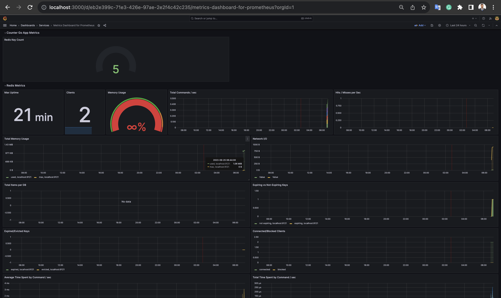

# Zerodha Ops Task (Solution)

## Description

This is a sample `Go` application which connects to Redis. The app increments a Redis `counter` on an incoming request.

### Setting up the app

- Use `make build` to compile the binary.
- Set the environment variables:
  - `DEMO_APP_ADDR`: Address where the app should listen to
  - `DEMO_REDIS_ADDR`: Address where Redis is running

---
## Tasks

- Create a `Dockerfile` for the app. [DONE]

- Create a `docker-compose.yml` for the app which includes the following:
  - [X] `redis` service, with data directory mounted. [DONE]
  - [X] `app` service, ensuring that it has a dependency on the Redis service starting correctly. [DONE]
  - [X] `nginx` service acting as a reverse proxy for the app. [DONE]
    - [x] Bonus: Implement SSL using self-signed certificates. 
      - Generate the certs using: `./scripts/ssl/generate_self_signed_certs.sh`
      - The Nginx config can be found at: `./app/config/nginx`
      - Deploy the application: `docker-compose up -d`
---
- [X] Write a bash script to set up a [Vagrant box](https://vagrant.io) with Ubuntu. Ensure the script has error checks and is idempotent.
#### Provision the Ubuntu Vagrant VM
```bash
sudo chmod +x ./scripts/vm/boot.sh
./scripts/k8s/boot.sh
```
#### Destroy the Ubuntu Vagrant VM
```bash
sudo chmod +x ./scripts/vm/destroy.sh
./scripts/k8s/destroy.sh
```
---
#### Ansible
The ansible playbook can be found at: `./playbooks`
- Using Ansible provision the VM to:
  - [x] Setup hostname of VM as `demo-ops`.
  - [x] Create a user `demo`.
  - [ ] Harden the security:
    - [x] Disable root login.
    - [ ] Setup a basic firewall (e.g., UFW) allowing only specific ports. (Unable to allow ports via firewall using qemu Vagrant provider, so as a workaround I have forwared the required ports to host machine)
  - [ ] Configure `sysctl` for sane defaults. (For eg: increasing open files limit) [`SKIPPED due to time constraint`]
  - [ ] Configure sysctl for sane defaults. For each sysctl parameter changed: [`SKIPPED due to time constraint`]
    - [ ] Document the change.
    - [ ] Provide a brief justification or explanation (2-3 lines) detailing why this specific change was made and its implications.
  - [x] Set the system's timezone to "Asia/Kolkata".
  - [x] Install Docker and Docker-Compose.
  - [x] Configure Docker Daemon to have sane defaults. For eg: keep logs size in check.
  - [x] Deploy the `docker-compose.yml` in `/etc/demo-ops` and start the services.
  - [x] Bonus: Install and configure monitoring tools like Prometheus and Grafana. Ensure app and redis metrics are being scraped.
    - 

- [x] Commit the scripts to Github and share the link.

---
### Bonus Section

If you have extra time and experience working with Kubernetes or Nomad, you're welcome to attempt the following bonus scenarios. Remember, this section is optional and designed to explore advanced skills.

#### K8s

- [x] Create a namespace `demo-ops`
- [x] Create a deployment and service manifest for the app.
- [x] Configure liveliness check, resource quotas for the deployment.

#### Deploy to K8s
```bash
sudo chmod +x ./scripts/k8s/deploy.sh
./scripts/k8s/deploy.sh
```

#### Deploy Workloads
```bash
sudo chmod +x ./scripts/k8s/destroy.sh
./scripts/k8s/destroy.sh
```